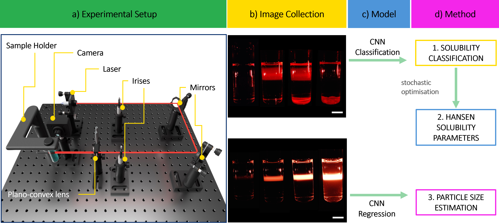

# PolyChar

Official codebase for "Advancements in Polymer Characterisation Analysis: A Laser-Based System Integrating Computer Vision for Polymer Characterisation" 

PolyChar is a simple laser-based platform that combines computer vision and deep learning models to classify the solubility of different polymeric compounds across a range of solvents. Using the results obtained from the solubility screening method, Hansen Solubility Parameters (HSP) of the polymers using are determined using an optimisation algorithm. Additionally, a Convolutional Neural Network regression model is also used to estimate the size of polymeric nanoparticles between 20-470 nm.


## Method




## Installation

To install the repository, follow these steps:

1. **Clone the repository**:
    ```sh
    git clone https://github.com/yourusername/PolyChar.git
    cd PolyChar
    ```

2. **Create a conda environment**:
    ```sh
    conda create --name polychar_env python=3.9
    conda activate polychar_env
    ```

3. **Install the required dependencies**:
    ```sh
    pip install -r requirements.txt
    ```

4. **Verify the installation**:
    ```sh
    python -m unittest discover
    ```


## Solubility Results

Running solubility.ipynb on the solubility dataset should give the following results (ommitting @3 and @2 metrics).

| Model             |F1 Score@4     | Accuracy@4    | Precision@4   | Recall@4      |
|--------------     |-----------    |--------       |----------     |----------     |
| ResNet18          | 0.868±0.045   | 0.901±0.037   | 0.865±0.054   | 0.886±0.047   |
| EfficientNet B0   | 0.853±0.055   | 0.891±0.043   | 0.850±0.063   | 0.876±0.061   |
| ConvNext Tiny     | 0.865±0.045	| 0.904±0.035	| 0.869±0.051	| 0.878±0.050   |


## HSP Results


| Polymer | Conc. (% w/v) | δD (GT) | δP (GT) | δH (GT) | δD (Pred) | δP (Pred) | δH (Pred) | R₀   | ED  | PED (%) |
| ------- | ------------- | ------- | ------- | ------- | --------- | --------- | --------- | ---- | --- | ------- |
| PMMA    | 5             | 18.6    | 10.5    | 5.1     | 17.4      | 10.4      | 3.1       | 9.2  | 2.4 | 11      |
| PS      | 5             | 18.5    | 4.5     | 2.9     | 18.1      | 3.9       | 5.7       | 4.5  | 2.9 | 15      |
| PVP     | 5             | 17.5    | 8.0     | 15.0    | 20.0      | 12.6      | 14.1      | 13.4 | 5.3 | 22      |
| PCL     | 5             | 17.7    | 5.0     | 8.4     | 18.3      | 10.5      | 5.0       | 9.6  | 6.5 | 32      |


## Particle Size Results


| Method                    | MAE (nm)(mean ± std)     | RMSE (nm)(mean ± std)     | R²(mean ± std)     |
| ------------------------- | ------------------------ | ------------------------- | ------------------ |
| **PPSNet - MLP (Sine)**   | **9.91 ± 3.42**          | **15.76 ± 6.96**          | **0.98 ± 0.01**    |
| PPSNet (no conditioning)  | 22.25 ± 3.97             | 32.01 ± 6.95              | 0.93 ± 0.04        |
| Polynomial Regression     | 32.55 ± 6.67             | 47.81 ± 9.58              | 0.87 ± 0.03        |
| EfficientNet - MLP (Sine) | 14.57 ± 3.71             | 23.64 ± 6.87              | 0.96 ± 0.02        |


## Project Structure

The project is organized as follows:

```
PolyChar/
├── Solubility/
│   ├── dataloaders.py 
│   ├── train_classifier.py 
│   ├── results/
│   │   └── Summarize_results.ipynb
│   ├── solubility_and_hparams.ipynb
│   ├── models.py 
│   └── utils.py 
├── ParticleSize/
│   ├── dataloaders.py 
│   ├── train_regression.py 
│   ├── ps_models.py 
│   ├── polynomial_regression.ipynb
│   ├── particle_size.ipynb
│   ├── figures.ipynb
│   └── utils.py 
├── HSP/
│   ├── Genetic_Algo_vebber.py
├── README.md
└── requirements.txt
```

### Other Files
- **README.md**: This file, providing an overview of the project.
- **requirements.txt**: Lists the dependencies required to run the project.

